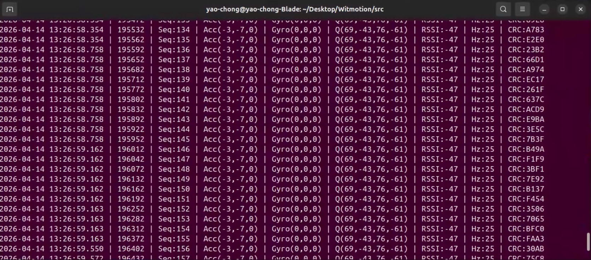

# Witmotion BLE IMU Streaming (NRF52832 + RTT)


This project streams IMU data from a Witmotion BLE sensor (tested with `WT901BLE67`) using an `nRF52832 DK` as the BLE central, then logs decoded samples on a Linux host through RTT.

## What Works

- Real-time BLE ingestion from Witmotion sensor
- Packet reassembly and decode in firmware (accel/gyro/euler->quat)
- Host-side timestamped CSV logging
- Per-sample CRC16 generation in firmware and verification on host

## Architecture

```
Witmotion WT901BLE67 (BLE notifications)
    ->
nRF52832 DK (Zephyr central, decode + CRC16)
    ->
RTT
    ->
src/read_usb.sh -> src/read_usb.py (pynrfjprog)
    ->
CSV log (with crc_ok column)
```

## Quick Start

### 1) Clone

```bash
git clone https://github.com/yaochongchow/Witmotion.git
cd Witmotion
```

### 2) Build and flash firmware

Assumes nRF Connect SDK is installed at `~/ncs/v3.0.2` and toolchain exists.

```bash
TOOLCHAIN_DIR=~/ncs/toolchains/7cbc0036f4
export PATH="$PWD/venv/bin:$TOOLCHAIN_DIR/usr/local/bin:$TOOLCHAIN_DIR/usr/bin:$TOOLCHAIN_DIR/opt/bin:$TOOLCHAIN_DIR/opt/zephyr-sdk/arm-zephyr-eabi/bin:$PATH"
export ZEPHYR_TOOLCHAIN_VARIANT=zephyr
export ZEPHYR_SDK_INSTALL_DIR="$TOOLCHAIN_DIR/opt/zephyr-sdk"

cd ~/ncs/v3.0.2
west build -b nrf52dk/nrf52832 --no-sysbuild /path/to/Witmotion/nrf52_firmware
cd build
west flash
```

### 3) Run host logger

Power on the sensor, then:

```bash
cd /path/to/Witmotion/src
AUTO_RESET=1 STARTUP_DELAY_SEC=0.6 ./read_usb.sh
```

Defaults are optimized for fast attach; `AUTO_RESET=1` is more reliable right after flashing.

## Output Format

Terminal output:

```text
DateTime                | Time(ms) | Seq  | Acc(x,y,z) | Gyro(x,y,z) | Q(w,x,y,z) | RSSI | Hz | CRC16
2026-04-14 13:03:53.714 | 1904 | Seq:0 | Acc(2,-8,0) | Gyro(0,0,0) | Q(31,-5,-90,84) | RSSI:-53 | Hz:0 | CRC:3731
```

CSV columns:

```text
datetime,fw_time_ms,seq,acc_x,acc_y,acc_z,gyro_x,gyro_y,gyro_z,qw,qx,qy,qz,rssi_dbm,hz,crc16,crc_ok
```

- `crc16`: calculated CRC16-CCITT-FALSE for the sample payload
- `crc_ok`: `1` when host verification matches firmware CRC, else `0`

## Result



## Key Runtime Files

- [nrf52_firmware/src/main.c](nrf52_firmware/src/main.c)
- [nrf52_firmware/src/witmotion_central.c](nrf52_firmware/src/witmotion_central.c)
- [src/read_usb.sh](src/read_usb.sh)
- [src/read_usb.py](src/read_usb.py)

## Notes

- RTT logging path is implemented through `pynrfjprog` for reliability on this setup.
- Sensor auto-detection supports Witmotion naming/UUID matching and known address fallback.
- For setup details and alternatives, see [SETUP.md](SETUP.md) and [RUN.md](RUN.md).
